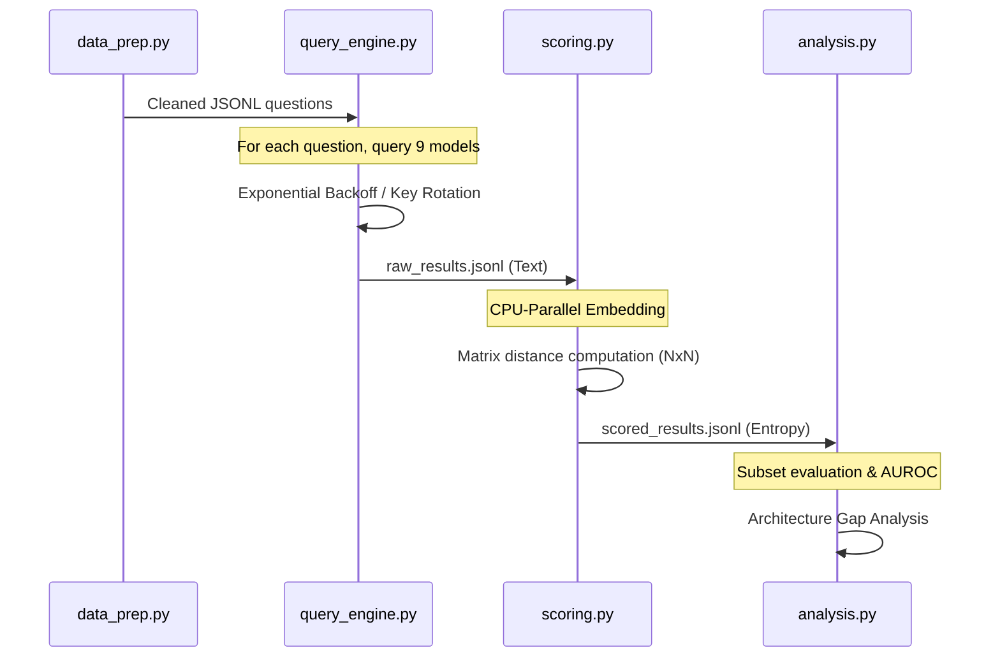

# Pipeline & Scoring Logic

This document provides a technical deep dive into how Disagreement Entropy (DES) is computed and the logic behind the multi-model pipeline.

## 📐 Scoring Formula

The core metric is a weighted fusion of **Surface Disagreement** and **Semantic Disagreement**.

### 1. Surface Disagreement (Weight: 0.4)
Detects literal character differences. Before scoring, we apply aggressive normalization:
- Lowercasing
- Stripping punctuation and extra whitespace
- Stripping Chain-of-Thought tags (`<think>`)

**Algorithm**: We calculate the Shannon Entropy over the frequency distribution of normalized tokens across the $N$ models.

### 2. Semantic Disagreement (Weight: 0.6)
Detects differences in meaning that exact matching might miss (e.g., "Paris" vs "Capital of France").
- **Embedding**: We use the `all-MiniLM-L6-v2` transformer to generate 384-dimensional vectors for each response.
- **Clustering**: A cosine similarity threshold ($\alpha$) is applied. Vectors with similarity > $\alpha$ (default 0.85) are merged into the same semantic cluster.

**Algorithm**: Entropy is calculated based on the distribution of these semantic clusters.

---

## 🔄 Core Workflow Details

## 🛠 Optimization: Matrix Pre-computation
To prevent explosive compute times when evaluating model subsets (e.g., "what if we only used 3 models?"), the pipeline pre-calculates the distance matrix for all $N$ models once per question. This allows the analysis script to perform $O(1)$ lookups instead of $O(N^2)$ embeddings during simulation sweeps.
