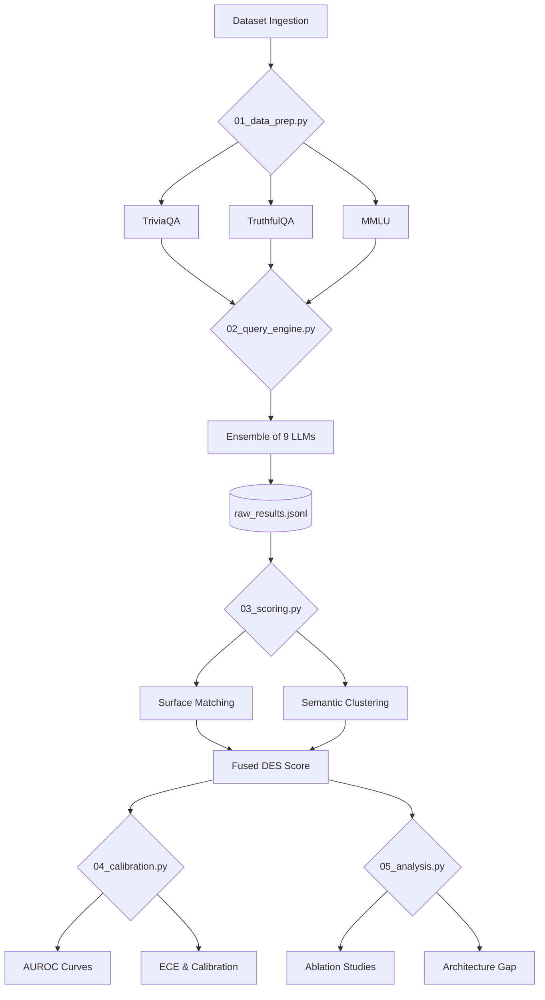

# Disagreement Entropy Score (DES): A Zero-Cost Hallucination Proxy

This repository contains the official implementation for the paper:  
**"Disagreement Entropy as a Zero-Cost Hallucination Proxy: A Cross-Architecture Empirical Study Across Diverse LLM Families."**

The project investigates a black-box, training-free method for detecting hallucinations by querying an ensemble of structurally distinct Large Language Models (LLMs) and measuring their semantic and surface-level disagreement.

## 🚀 Key Achievements
- **High Accuracy**: Achieved a binary classification **AUROC of 0.9613** using a fused 9-model ensemble.
- **Zero-Cost**: Requires no access to model log-probabilities or heavy retrieval-augmented generation (RAG) infrastructure.
- **Reasoning Boost**: Discovered that allowing models to "think" (Chain-of-Thought) increases the reliability of the disagreement signal by **~4%**.
- **Architecture Insights**: Proved that architectural diversity is more critical than raw parameter count in detecting shared biases.

---

## 🏗 System Architecture

The following diagram illustrates the end-to-end data pipeline, from dataset ingestion to the final empirical analysis.



---

## 📂 Repository Structure

- `src/`: Core Python implementation scripts (Scoring, Calibration, Analysis).
- `paper/`: LaTeX source for the research paper, including the `pdf/` figure assets.
- `data/`: Processed datasets and intermediate results (partially tracked).
- `outputs/tables/`: Auto-generated LaTeX and CSV tables used in the publication.
- `DOCS/`: Extended technical documentation and development logs.

## 🛠 Setup & Usage

### 1. Requirements
Ensure you have Python 3.11+ and install the dependencies:
```bash
pip install -r requirements.txt
```

### 2. Execution Pipeline
The pipeline is designed to be deterministic and resume-friendly.
```bash
# Prepare datasets
python src/01_data_prep.py

# Run the 18,000+ API query engine (requires LiteLLM setup)
python src/02_query_engine.py

# Compute DES scores
python src/03_scoring.py

# Generate statistical analyses
python src/04_calibration.py
python src/05_analysis.py
```

---

## 📖 Deep Documentation
For more detailed insights, please refer to the following:
- [Pipeline Details](./DOCS/PIPELINE.md): Detailed breakdown of scoring logic and weights.
- [Development Log](./DOCS/HURDLES.md): Hurdles faced, historical context, and technical fixes.
- [Empirical Results](./DOCS/RESULTS.md): Detailed analysis of discovery proofs and SWOT analysis.
- [Model Ensemble](./DOCS/MODELS.md): Architectural details of the 9 models used.
